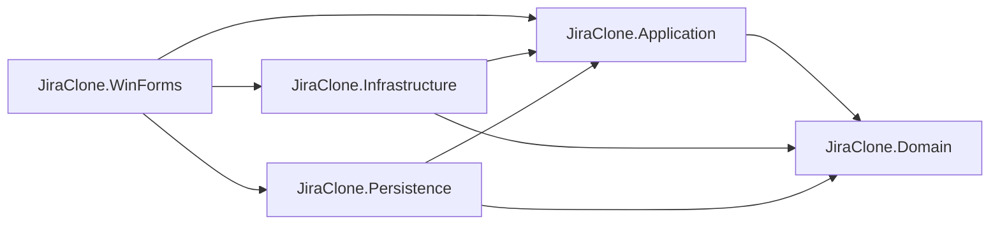
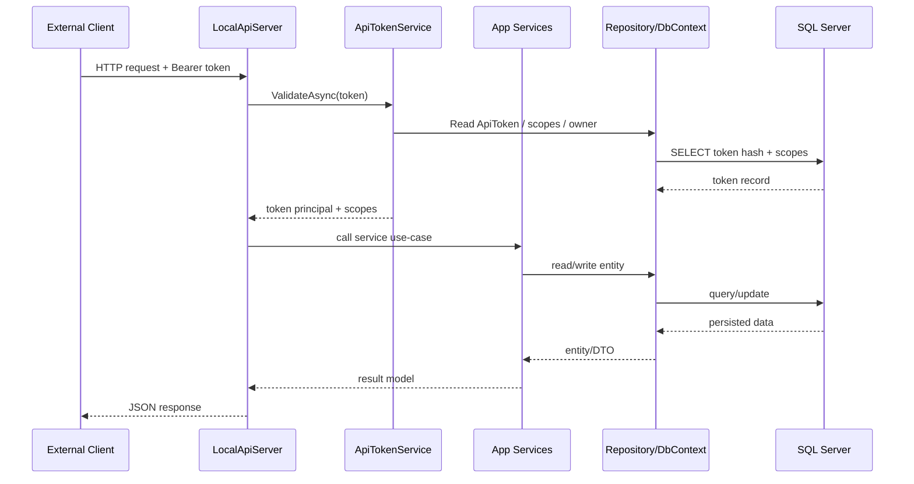

# PROJECT AUDIT REPORT — Jira Clone Desktop WinForms
**Ngày tạo:** 01/04/2026  
**Trạng thái:** Pre-release Testing Phase  
**Mục đích:** Context handoff cho AI session mới trước giai đoạn kiểm thử cuối và đóng gói `.exe`

## 1. TỔNG QUAN DỰ ÁN

Jira Clone Desktop WinForms là một ứng dụng desktop `.NET 8 WinForms` mô phỏng phần lớn các năng lực cốt lõi của Jira cho bối cảnh quản lý dự án nội bộ: quản lý project, issue, sprint, board Scrum/Kanban, roadmap, báo cáo, cấu hình workflow/quyền, tích hợp GitHub/Confluence, webhook, API token và local REST API.

Dự án hiện được tổ chức theo mô hình **layered monolith** gồm 5 project runtime chính:
- `JiraClone.Domain`: entity, enum, permission default, invariant nghiệp vụ.
- `JiraClone.Application`: service layer, DTO/model, rule nghiệp vụ, façade use-case.
- `JiraClone.Infrastructure`: tích hợp ngoài (OAuth, Mail, GitHub, Confluence, webhook, local API, DPAPI).
- `JiraClone.Persistence`: EF Core DbContext, repository, migrations, seed data.
- `JiraClone.WinForms`: UI desktop, composition root, navigation shell, control custom.

Tại thời điểm audit:
- `dotnet build src/JiraClone.WinForms/JiraClone.WinForms.csproj` chạy xanh (`0 warnings`, `0 errors`).
- `dotnet test tests/JiraClone.Tests/JiraClone.Tests.csproj --no-build` chạy xanh (`105 passed`).
- Ứng dụng đang ở giai đoạn **ổn định hóa trước release**: nghiệp vụ chính đã có, nhưng vẫn còn technical debt ở localization, đóng gói release, migration hygiene, và tính nhất quán authorization giữa role toàn cục với permission theo project.

### 1.1 Nhận định nhanh

**Điểm mạnh hiện tại**
- Kiến trúc tách lớp khá rõ ràng, phần UI không truy cập DB trực tiếp.
- Có test tự động tương đối rộng cho service layer, auth, local API token, migration script.
- Có seed data, remember-me, OAuth, local API token, webhook, GitHub/Confluence integration.
- AppSession đóng vai trò façade runtime khá tốt cho WinForms shell.

**Điểm cần lưu ý trước khi bàn giao / đóng gói**
- Có secret thật trong `appsettings*.json` (SQL Server, SMTP placeholders, runtime config nhạy cảm).
- Một số file localization đang có chuỗi mojibake/vỡ dấu, đặc biệt `src/JiraClone.WinForms/Helpers/VietnameseUi.cs`.
- Có migration `.cs` bị thiếu `.Designer.cs`, gây rủi ro khi tái tạo DB từ đầu.
- Không thấy `.sln`, `.pubxml`, `.msixproj`, `.wixproj`, `.iss`, icon/version metadata cho bản phát hành.
- Một số quyền dùng `AuthorizationService.EnsureInRole(...)` (global role), trong khi nơi khác dùng `PermissionService` (project permission), dẫn tới rủi ro mismatch.

## 2. KIẾN TRÚC & CẤU TRÚC THƯ MỤC

### 2.1 Cấu trúc repo thực tế

Các thư mục/top-level đáng chú ý:
- `.agent`, `.codex`: metadata cho agent / skill.
- `.vs`, `.vscode`: IDE state.
- `artifacts`: output/test artifacts phát sinh.
- `database`: tài nguyên phụ trợ DB nếu có.
- `logs`: log runtime của app.
- `src`: toàn bộ source runtime.
- `tests`: test project.
- `DEPLOYMENT_CHECKLIST.md`, `MANUAL_TEST_CHECKLIST_VI.md`, `PROJECT_AUDIT_v4.md`: tài liệu vận hành/audit cũ.

Không tìm thấy file `.sln` trong repo tại thời điểm audit. Dự án hiện được build/test trực tiếp qua `.csproj`.

### 2.2 Các project trong solution logic

| Project | Target | Vai trò | Reference nội bộ chính |
| --- | --- | --- | --- |
| `src/JiraClone.Domain/JiraClone.Domain.csproj` | `net8.0` | Domain entities, enum, permission default | Không reference project khác |
| `src/JiraClone.Application/JiraClone.Application.csproj` | `net8.0` | Service layer, use-case, DTO/model | `JiraClone.Domain` |
| `src/JiraClone.Infrastructure/JiraClone.Infrastructure.csproj` | `net8.0` | OAuth, email, GitHub, Confluence, local API, webhook, DPAPI | `JiraClone.Application`, `JiraClone.Domain` |
| `src/JiraClone.Persistence/JiraClone.Persistence.csproj` | `net8.0` | EF Core DbContext, repository, migrations, seed | `JiraClone.Application`, `JiraClone.Domain` |
| `src/JiraClone.WinForms/JiraClone.WinForms.csproj` | `net8.0-windows` | UI shell, forms, controls, DI startup | `Application`, `Infrastructure`, `Persistence` |
| `tests/JiraClone.Tests/JiraClone.Tests.csproj` | `net8.0` | Unit/integration test | Reference toàn bộ 5 project runtime |

### 2.3 NuGet package và dependency chính

**WinForms** (`src/JiraClone.WinForms/JiraClone.WinForms.csproj`)
- `Microsoft.EntityFrameworkCore.Design` `8.0.12`
- `Microsoft.Extensions.Configuration.EnvironmentVariables` `8.0.0`
- `Microsoft.Extensions.Configuration.Json` `8.0.1`
- `Microsoft.Extensions.DependencyInjection` `8.0.1`
- `Microsoft.Extensions.Logging.Abstractions` `8.0.2`
- `Serilog` `4.2.0`
- `Serilog.Extensions.Logging` `8.0.0`
- `Serilog.Settings.Configuration` `8.0.0`
- `Serilog.Sinks.Console` `6.0.0`
- `Serilog.Sinks.File` `6.0.0`

**Application**
- `Markdig` `0.37.0`
- `Microsoft.Extensions.Logging.Abstractions` `8.0.2`
- `Serilog` `4.2.0`

**Infrastructure**
- `MailKit` `4.8.0`
- `Octokit` `13.0.1`
- `System.Security.Cryptography.ProtectedData` `8.0.0`
- `System.IdentityModel.Tokens.Jwt` `8.14.0`
- `Serilog` / `Logging.Abstractions`

**Persistence**
- `Microsoft.EntityFrameworkCore` `8.0.12`
- `Microsoft.EntityFrameworkCore.SqlServer` `8.0.12`
- `Microsoft.EntityFrameworkCore.Design` `8.0.12`
- `Configuration.Json`, `Configuration.EnvironmentVariables`, `Serilog`

**Tests**
- `xunit`, `xunit.runner.visualstudio`, `Moq`, `coverlet.collector`, `Microsoft.EntityFrameworkCore.InMemory`

### 2.4 Pattern kiến trúc đang dùng

Pattern nổi bật có thể xác định trực tiếp từ code:
- **Layered Monolith**: UI → Application → Domain/Persistence/Infrastructure.
- **Service Layer**: các use-case nằm trong `Application` (`IssueService`, `ProjectCommandService`, `SprintService`, `UserCommandService`...).
- **Repository Pattern**: repository ở `Persistence/Repositories`, service không dùng EF trực tiếp trong phần lớn luồng nghiệp vụ.
- **Composition Root / Dependency Injection**: toàn bộ registration nằm ở `src/JiraClone.WinForms/Program.cs`.
- **Facade Session Runtime**: `src/JiraClone.WinForms/Composition/AppSession.cs` gom tất cả service dependency cho UI.
- **WinForms Code-Behind / View-Controller Hybrid**: mỗi Form tự build layout, giữ state cục bộ và gọi service qua `AppSession`.
- **Background Worker Pattern**: `GitHubIntegrationSyncWorker`, `WebhookDispatcher`, notification polling trong `MainForm`.
- **Local API Host**: `HttpListener` nội bộ qua `src/JiraClone.Infrastructure/Api/LocalApiServer.cs`.

### 2.5 Sơ đồ dependency mức cao

### 2.6 Composition root và startup runtime

File quan trọng nhất khi boot app là `src/JiraClone.WinForms/Program.cs`.

Trách nhiệm chính của `Program.cs`:
- Set high DPI: `HighDpiMode.PerMonitorV2`.
- Set culture `vi-VN` cho UI/thread hiện tại.
- Gọi `VietnameseUi.InitializeGlobalHook()`.
- Load config từ:
  - `appsettings.json`
  - `appsettings.{Environment}.json`
  - environment variable prefix `JIRACLONE_`
- Setup Serilog.
- Register DbContextFactory, repository, application service, infrastructure service.
- Start `GitHubIntegrationSyncWorker` và `LocalApiServer`.
- Restore persistent session (`session.dat`) nếu còn hợp lệ.
- Mở `LoginForm` hoặc `MainForm` tùy trạng thái xác thực.

## 3. NGHIỆP VỤ & TÍNH NĂNG

### 3.1 Main shell và điều hướng

**File:** `src/JiraClone.WinForms/Forms/MainForm.cs`  
**Vai trò:** shell chính sau đăng nhập, chứa sidebar, top navbar, `_contentPanel`, notification dropdown, project switcher.

**Method quan trọng**
- `BuildLayout()`: tạo 2 cột sidebar + main area.
- `BuildSidebar()`: sidebar trái gồm project switcher, nav item, user/logout block.
- `BuildMainArea()`: navbar + `_contentPanel`.
- `NavigateTo(...)`: thay form hiện hành trong `_contentPanel`.
- `LoadProjectContextAsync(...)`: chọn project active và điều hướng màn mặc định.
- `ApplyShellSearch()`: đẩy text search của shell xuống màn con hỗ trợ.
- `PollNotificationsAsync()` / `BindNotifications(...)`: poll + render thông báo.

### 3.2 Các màn hình / form chính

| File | Trách nhiệm | Method / entry point quan trọng | Ghi chú |
| --- | --- | --- | --- |
| `Forms/LoginForm.cs` | đăng nhập local, remember-me, SSO OAuth | `BuildLayout`, `BuildPasswordHost`, `LoginAsync`, `LoginWithSsoAsync`, `CompleteLoginAsync` | có custom card layout, remember-me warning, browser SSO |
| `Forms/ProjectListForm.cs` | danh sách project dạng card/grid, tạo/mở project | `RefreshProjectsAsync`, `BuildHeader`, `BuildSurface`, `BindProjects`, `CreateProjectAsync`, `OpenProjectAsync` | tạo project phụ thuộc global role Admin/ProjectManager |
| `Forms/BoardForm.cs` | board Scrum/Kanban, filter, group by epic, drag-drop issue | `BuildTopBar`, `BuildFilterBar`, `LoadBoardAsync`, `PopulateHeader`, `ApplyFilters`, `GetBoardModeIssues` | `OnBoardItemClick` và `OnBacklogItemClick` cùng dùng `BoardForm`, chỉ khác cờ `activeSprintOnly` |
| `Forms/IssueNavigatorForm.cs` | màn issue navigator, JQL-like query, saved filter, grid kết quả | `BuildLayout`, `BuildQueryRegion`, `BuildFiltersSidebar`, `ConfigureGrid`, `ExecuteCurrentQueryAsync`, `SaveCurrentFilterAsync` | đã được chỉnh để action/filter nằm trong nội dung tab |
| `Forms/IssueDetailsForm.cs` | xem chi tiết issue, comment, attachment, workflow transition | `ReloadDetailsAsync` và nhiều event handler status/priority/comment | file lớn nhất repo (~2354 dòng), nhiều trách nhiệm UI |
| `Forms/IssueEditorForm.cs` | tạo/sửa issue, gắn parent/epic, due date, story point | `BuildLayout`, `LoadDataAsync`, `SaveAsync`, `RefreshParentListAsync`, `SetParentFieldState` | `Story/Task` dùng field `Epic Link`, `Subtask` dùng `Parent` |
| `Forms/SprintManagementForm.cs` | tạo sprint, gán issue, start/close sprint | `BuildActions`, `LoadSprintsAsync`, `CreateSprintAsync`, `AssignIssuesAsync`, `StartSprintAsync`, `CloseSprintAsync` | đây là màn đang chứa sprint management thật; tab Backlog chưa có luồng planning riêng |
| `Forms/RoadmapForm.cs` | timeline epic, filter sprint/assignee, zoom, reschedule | `BuildContentArea`, `BuildTimelineAndDetail`, `OnTimelineEpicClicked`, `OnTimelineEpicDoubleClicked`, `OnTimelineZoomChanged` | UI đã được chỉnh lại nhưng vẫn cần ổn định localization |
| `Forms/ReportsForm.cs` | burndown, velocity, cumulative flow, sprint report, export PNG | `BuildBurndownTabContent`, `BuildVelocityTabContent`, `BuildCfdTabContent`, `BuildSprintReportTabContent`, `ExportCurrentReport` | file lớn, có vẽ chart custom và export bitmap |
| `Forms/ProjectSettingsForm.cs` | profile/general/members/columns/workflow/permissions/labels/components/webhooks/integrations | nhiều `Build*Tab`, `Configure*`, handler CRUD | form cấu hình lớn thứ hai (~1980 dòng) |
| `Forms/UserManagementForm.cs` | CRUD user, kích hoạt/vô hiệu hóa, reset password | `BuildHeader`, `BuildToolbar`, `LoadUsersAsync`, `BindUsers`, `CreateAsync`, `EditAsync`, `ResetPasswordAsync` | tab chỉ hiện với Admin |
| `Forms/DashboardForm.cs` | dashboard overview, sprint progress, issue stats, workload | `BuildLayout`, `RefreshDashboardAsync` | phần tổng quan cho project active |

### 3.3 Luồng nghiệp vụ chính hiện có

**Xác thực và vào app**
- Người dùng mở app → `LoginForm`.
- Có thể đăng nhập bằng local credential hoặc OAuth nếu bật cấu hình.
- Nếu remember-me hợp lệ, app bỏ qua login và vào thẳng `MainForm`.

**Quản lý project**
- Xem project mình được cấp quyền.
- Mở project để set active context trong `AppSession`.
- Tạo project mới nếu là `Admin` hoặc `ProjectManager` toàn cục.

**Quản lý issue**
- Tạo issue từ shell hoặc tab `Issue`.
- Sửa issue, đổi trạng thái, comment, attachment, assignee, label, component, version.
- Gắn issue vào epic qua `Epic Link`.
- Mở chi tiết issue từ board, roadmap, issue navigator.

**Scrum / Kanban board**
- `Board` ở chế độ Scrum dùng sprint active.
- `Backlog` hiện tại thực chất là `BoardForm(activeSprintOnly: false)` chứ chưa phải backlog planning screen độc lập.
- Có filter assignee / priority / type / search / group by epic.
- Có chuyển mode Scrum/Kanban, WIP limit event, swimlane epic.

**Sprint management**
- Tạo sprint, gán issue vào sprint, start sprint, close sprint.
- Chỉ cho phép một sprint active trong một project (unique constraint + service rule).

**Roadmap**
- Hiển thị epic theo timeline.
- Filter theo sprint / assignee.
- Zoom timeline.
- Kéo thanh epic để cập nhật `StartDate` / `DueDate`.
- Double click để mở `IssueDetails` của epic.

**Project settings**
- Cấu hình board columns, workflow, permission scheme, member, label, component, version.
- Quản lý webhook.
- Cấu hình GitHub / Confluence tích hợp.

### 3.4 Tính năng đã hoàn thành vs chưa hoàn thành

**Đã có trong code**
- Local login + remember-me.
- OAuth login với PKCE + JWKS validation.
- CRUD project cơ bản.
- CRUD issue + comment + attachment + watcher + notification.
- Scrum board / Kanban board.
- Sprint management.
- Roadmap timeline cho epic.
- Report: burndown, velocity, cumulative flow, sprint report.
- API token + local REST API.
- Webhook dispatch.
- GitHub và Confluence integration.
- Permission scheme và workflow editor.
- Saved filter / JQL-like navigator.

**Mới có một phần hoặc còn hạn chế**
- `Backlog` chưa là màn planning riêng theo kỳ vọng Jira; hiện tái sử dụng `BoardForm`.
- Đóng gói `.exe`/installer chưa có pipeline hoặc metadata hoàn chỉnh.
- Localization tiếng Việt chưa đồng nhất, còn vỡ dấu ở một số map text.
- Một số UI/permission vừa được chỉnh nhiều, cần manual regression test thêm.
- Không có tài liệu README chính thức cập nhật theo trạng thái hiện tại.
## 4. TÍCH HỢP JIRA API

### 4.1 Kết luận quan trọng

Không tìm thấy code gọi **Jira Cloud REST API của Atlassian** trong project hiện tại. Thay vào đó, hệ thống đang làm hai việc khác nhau:
- **Đóng vai Jira clone**: chính ứng dụng lưu dữ liệu project/issue/sprint trong local SQL Server.
- **Expose local REST API kiểu Jira-like**: cho client ngoài gọi vào app desktop qua token.

Vì vậy phần “Jira API” trong dự án này thực chất là **local desktop API** chứ không phải outbound integration sang Jira thật.

### 4.2 Local REST API đang expose

**File chính:** `src/JiraClone.Infrastructure/Api/LocalApiServer.cs`

**Host / Port**
- `http://127.0.0.1:47892/`
- `http://localhost:47892/`

**Cơ chế auth**
- Header `Authorization: Bearer <token>`
- Token là API token nội bộ, prefix raw token: `jdt_...`
- Server không lưu raw token; DB chỉ lưu SHA-256 hash qua `ApiTokenService`
- Mỗi token có scope riêng (`ReadIssues`, `WriteIssues`, `ReadProjects`, `ManageProjects`)

### 4.3 Endpoint chi tiết

| Method | Route | Scope | Permission nội bộ | Request | Response |
| --- | --- | --- | --- | --- | --- |
| `GET` | `/api/v1/issues?projectKey={key}` | `ReadIssues` | `ViewProject` | Query `projectKey` | JSON array issue summary |
| `POST` | `/api/v1/issues` | `WriteIssues` | `CreateIssue` | JSON body tạo issue | JSON object issue vừa tạo |

#### `GET /api/v1/issues`

Luồng xử lý:
1. `LocalApiServer` nhận HTTP request.
2. `AuthorizeAsync` validate Bearer token qua `IApiTokenService.ValidateAsync`.
3. Lấy `projectKey` từ query string.
4. Resolve project qua `IProjectRepository` / service tương ứng.
5. Check permission `ViewProject` cho user gắn với token.
6. Trả về danh sách issue dạng summary.

Thông tin response (từ code mapping hiện tại):
- `id`
- `issueKey`
- `title`
- `type`
- `priority`
- `status`
- `storyPoints`
- `assignees`

#### `POST /api/v1/issues`

Body model hiện tại được đọc từ JSON với các field:
- `ProjectKey`
- `Title`
- `DescriptionText` (optional)
- `Type` (optional)
- `Priority` (optional)
- `DueDate` (optional)
- `StoryPoints` (optional)

Luồng xử lý:
1. Validate Bearer token và scope `WriteIssues`.
2. Resolve project theo `ProjectKey`.
3. Check permission `CreateIssue`.
4. Dựng `IssueEditModel`.
5. Gọi `IssueService.CreateAsync(...)`.
6. Trả JSON object chứa:
   - `id`
   - `issueKey`
   - `title`
   - `projectId`
   - `workflowStatusId`
   - `priority`
   - `type`

### 4.4 API token service

**File:** `src/JiraClone.Application/ApiTokens/ApiTokenService.cs`

Cơ chế chính:
- Raw token chỉ hiện một lần khi tạo, kết quả trả về qua `GeneratedTokenResult`.
- DB lưu `TokenHash`, không lưu raw token.
- Scope được lưu trong `ApiTokenScopeGrant`.
- Mỗi lần dùng token, service cập nhật `LastUsedAtUtc`.
- Thu hồi token bởi owner hoặc admin.

### 4.5 Data flow của local API

### 4.6 OAuth login (liên quan auth, không phải Jira API)

**File:** `src/JiraClone.Infrastructure/Auth/OAuthService.cs`

Điểm quan trọng:
- Dùng browser-based PKCE flow.
- Bắt callback qua loopback redirect (`http://localhost:8765/callback` theo config mặc định).
- Tải JWKS và cache 1 giờ.
- Validate đầy đủ: issuer, audience, expiry/lifetime, signing key, nonce.
- SSO user mới được auto-provision với role mặc định `Viewer`.

### 4.7 GitHub / Confluence integration (adjacent integration)

**GitHub**
- File: `src/JiraClone.Infrastructure/Integrations/GitHubIntegrationService.cs`
- Auth: GitHub token cấu hình theo project.
- Dùng `Octokit`.
- Regex nhận diện issue key trong commit/PR như `JIRA-123`.
- Ghi activity log link commit / PR vào project.

**Confluence**
- File: `src/JiraClone.Infrastructure/Integrations/ConfluenceIntegrationService.cs`
- Gọi REST API `.../wiki/rest/api/content`
- Auth kiểu Basic với `email:apiToken`
- Lưu config mã hóa bằng DPAPI qua `DpapiIntegrationConfigProtector`

## 5. DATA MODEL & STATE MANAGEMENT

### 5.1 Entity domain chính

**Project & permission**
- `Project`: key, name, description, category, `BoardType`, `Url`, `IsActive`, navigation tới issues/sprints/members/workflow/webhooks/integration config.
- `ProjectMember`: liên kết user với project và `ProjectRole`.
- `PermissionScheme`, `PermissionGrant`: mô hình quyền theo project.
- `Role`, `UserRole`: role toàn cục cấp hệ thống.

**Issue tracking**
- `Issue`: entity trung tâm, chứa issue key, title, description, type, priority, workflow status, reporter, assignee, estimate/time spent, story points, `StartDate`, `DueDate`, `BoardPosition`, `ParentIssueId`, `FixVersionId`, soft delete, concurrency `RowVersion`.
- `Comment`, `Attachment`, `Watcher`, `Notification`, `ActivityLog`: data phụ trợ quanh issue.
- `IssueAssignee`, `IssueLabel`, `IssueComponent`: bảng liên kết nhiều-nhiều.
- `Label`, `Component`, `ProjectVersion`: master data theo project.

**Board / sprint / roadmap**
- `BoardColumn`: map workflow status lên cột board + WIP limit.
- `Sprint`: tên, goal, start/end, state, closed time, soft delete.
- `WorkflowDefinition`, `WorkflowStatus`, `WorkflowTransition`: workflow engine theo project.

**API / integration / webhook**
- `ApiToken`, `ApiTokenScopeGrant`
- `ProjectIntegrationConfig`
- `WebhookEndpoint`, `WebhookEndpointSubscription`, `WebhookDelivery`

### 5.2 Danh sách entity được định nghĩa trong `src/JiraClone.Domain/Entities`

- `ActivityLog.cs`
- `ApiToken.cs`
- `ApiTokenScopeGrant.cs`
- `Attachment.cs`
- `BoardColumn.cs`
- `Comment.cs`
- `Component.cs`
- `Issue.cs`
- `IssueAssignee.cs`
- `IssueComponent.cs`
- `IssueLabel.cs`
- `Label.cs`
- `Notification.cs`
- `PermissionGrant.cs`
- `PermissionScheme.cs`
- `Project.cs`
- `ProjectIntegrationConfig.cs`
- `ProjectMember.cs`
- `ProjectVersion.cs`
- `Role.cs`
- `SavedFilter.cs`
- `Sprint.cs`
- `User.cs`
- `UserRole.cs`
- `Watcher.cs`
- `WebhookDelivery.cs`
- `WebhookEndpoint.cs`
- `WebhookEndpointSubscription.cs`
- `WorkflowDefinition.cs`
- `WorkflowStatus.cs`
- `WorkflowTransition.cs`

### 5.3 DTO / model được dùng bởi application layer

Các model/DTO được tìm thấy trực tiếp trong `src/JiraClone.Application`:
- `ApiTokens/GeneratedTokenResult.cs`
- `Integrations/ConfluencePageLinkDto.cs`
- `Integrations/GitHubCommitLinkDto.cs`
- `Integrations/GitHubPullRequestLinkDto.cs`
- `Models/AuthResult.cs`
- `Models/BoardColumnDto.cs`
- `Models/BoardColumnWipLimitEventArgs.cs`
- `Models/DashboardOverviewDto.cs`
- `Models/IssueDetailsDto.cs`
- `Models/IssueDto.cs`
- `Models/IssueEditModel.cs`
- `Models/IssueSummaryDto.cs`
- `Models/NotificationEmailTemplateModel.cs`
- `Models/NotificationItemDto.cs`
- `Models/PermissionGrantInput.cs`
- `Models/ProjectMemberInput.cs`
- `Models/RoadmapEpicDto.cs`
- `Models/SavedFilterDto.cs`
- `Models/SessionData.cs`
- `Models/SprintReportDto.cs`
- `Models/WorkflowDefinitionDto.cs`

### 5.4 DbContext và persistence

**DbContext runtime chính:** `src/JiraClone.Persistence/JiraCloneDbContext.cs`

DbSet đáng chú ý:
- `Projects`, `Issues`, `Sprints`, `Users`
- `BoardColumns`, `WorkflowDefinitions`, `WorkflowStatuses`, `WorkflowTransitions`
- `SavedFilters`, `Labels`, `Components`, `ProjectVersions`
- `Notifications`, `Watchers`, `Attachments`, `Comments`, `ActivityLogs`
- `ApiTokens`, `ApiTokenScopeGrants`
- `PermissionSchemes`, `PermissionGrants`
- `WebhookEndpoints`, `WebhookEndpointSubscriptions`, `WebhookDeliveries`

**Lưu ý technical debt**
- Có thêm `src/JiraClone.Persistence/Schema/JiraCloneSchemaDbContext.cs` trông như context schema song song/legacy. Search thời điểm audit không cho thấy nó được dùng rộng rãi như `JiraCloneDbContext`.

### 5.5 State management trong runtime desktop

**App-level state**
- `src/JiraClone.WinForms/Composition/AppSession.cs` là state hub của UI.
- Giữ `CurrentUserContext`, user hiện tại, project active, các service façade.
- Bọc nhiều service thành property như `Projects`, `Board`, `Issues`, `Sprints`, `Notifications`, `Users`, `Permissions`, `Integrations`, `Webhooks`...
- Dùng `_operationGate` để serialize nhiều thao tác async, giảm race condition UI.

**Session persistence**
- `DpapiSessionPersistenceService` lưu `SessionData` tại `%AppData%\JiraDesktop\session.dat`.
- Dùng DPAPI `CurrentUser` để mã hóa.
- Có xử lý temp file + replace và xóa session invalid/corrupt.

**Form-level state**
- Mỗi form giữ state cục bộ qua field private: filter hiện tại, danh sách DTO/entity đã load, selection, cancellation token, loading flag.
- Ví dụ `RoadmapForm` giữ `_allEpics`, `_filteredEpics`, `_selectedEpicId`, `_loading`, `_detailRequestVersion`.
- Ví dụ `BoardForm` giữ board mode, filter values, toast state, cancellation token cho reload.

**Config / culture state**
- Startup ép `vi-VN` culture cho UI thread.
- `VietnameseUi.InitializeGlobalHook()` hook text UI toàn cục, nhưng file translator hiện còn encoding issue.

## 6. DEPENDENCY & CONFIGURATION

### 6.1 Nguồn cấu hình

Từ `Program.cs`, app load config theo thứ tự:
1. `src/JiraClone.WinForms/appsettings.json`
2. `src/JiraClone.WinForms/appsettings.{Environment}.json`
3. Environment variables prefix `JIRACLONE_`

### 6.2 Các dependency ngoài runtime

| Thành phần | Nguồn / file | Vai trò |
| --- | --- | --- |
| SQL Server | `ConnectionStrings:DefaultConnection` | DB chính của toàn app |
| File system attachment root | `AppStorage:AttachmentsRoot` | lưu file đính kèm ngoài DB |
| Session file | `%AppData%\JiraDesktop\session.dat` | remember-me / persistent session |
| Log file | `logs\jira-clone-.log` | log runtime qua Serilog file sink |
| SMTP | `Email:Smtp:*` | gửi email thông báo |
| OAuth provider | `OAuth:*` | login SSO qua provider ngoài |
| Local API listener | `127.0.0.1:47892`, `localhost:47892` | local REST API |
| OAuth callback listener | `OAuth:RedirectUri` mặc định `http://localhost:8765/callback` | nhận browser callback |
| GitHub API | token + repo config per project | đồng bộ commit / PR link |
| Confluence REST API | base URL + email + token per project | tạo/link page |
| Webhook consumer | URL đích từng webhook | đẩy event ra ngoài |

### 6.3 Cấu hình đáng chú ý trong file appsettings

**`src/JiraClone.WinForms/appsettings.json`**
- Có connection string SQL Server thật (`Server=DESKTOP-ISSK39T;Database=JiraCloneWinForms;User Id=sa;Password=...`).
- `AppStorage:AttachmentsRoot = attachments`
- `AppStorage:MaxAttachmentBytes = 26214400` (~25 MB)
- SMTP host `smtp.gmail.com`, port `587`
- OAuth mặc định tắt (`Enabled = false`)
- Redirect mặc định `http://localhost:8765/callback`
- Serilog file log `logs\jira-clone-.log`

**`src/JiraClone.WinForms/appsettings.Development.json`**
- Cũng chứa connection string SQL Server.
- `AttachmentsRoot = attachments-dev`
- `MaxAttachmentBytes = 52428800` (~50 MB)
- Logging verbose hơn.

### 6.4 Vấn đề bảo mật cấu hình

Đây là finding nghiêm trọng nhất về configuration:
- Secret thật đang được commit trong repo.
- SQL Server credential đang nằm trực tiếp trong `appsettings*.json`.
- Điều này không phù hợp cho release/public handoff.
- Trước khi đóng gói `.exe`, bắt buộc externalize secrets hoặc chuyển sang secret store / environment variable.

### 6.5 Migration và schema evolution

Các migration hiện có trong `src/JiraClone.Persistence/Migrations` bao gồm:
- `InitialCreate`
- `CommentAndAttachmentSoftDelete`
- `IssueSoftDelete`
- `SprintSingleActiveConstraint`
- `AddParentIssueAndEpicType`
- `AddLabelsComponentsVersions`
- `AddWorkflowEngine`
- `AddSavedFilters`
- `AddSprintSoftDeleteForProjectDelete`
- `AddBoardTypeForKanban`
- `AddWatchersAndNotifications`
- `AddPermissionScheme`
- `AddIssueStartDateForRoadmap`
- `AddWebhooks`
- `AddProjectIntegrations`
- `AddEmailNotificationPreference`
- `AddApiTokens`
- `AddRememberMeSessionPersistence`
- `ResetSeedPasswordsToChangeMe123`

**Risk đã phát hiện**
- Một số migration `.cs` không có file `.Designer.cs` tương ứng:
  - `20260313224500_SprintSingleActiveConstraint.cs`
  - `20260318170000_AddEmailNotificationPreference.cs`
  - `20260318183000_AddRememberMeSessionPersistence.cs`
  - `20260320110000_ResetSeedPasswordsToChangeMe123.cs`
- Đây là rủi ro khi cần regenerate migration metadata, create DB from scratch hoặc diff schema về sau.
## 7. XỬ LÝ LỖI & LOGGING

### 7.1 Error handling trong UI

Mẫu xử lý lỗi phổ biến trong WinForms:
- Event handler `async void` bọc nghiệp vụ trong `try/catch` và gọi `ErrorDialogService.Show(...)`.
- Một số luồng dài dùng `RunCancelableUiOperationAsync(...)` trong `MainForm` để gom cancel + error boundary.
- `OperationCanceledException` thường được swallow có chủ đích khi người dùng cancel hoặc refresh chồng nhau.

File quan trọng:
- `src/JiraClone.WinForms/Services/ErrorDialogService.cs` (hiển thị popup lỗi cho người dùng)
- `src/JiraClone.WinForms/Forms/MainForm.cs` (`RunCancelableUiOperationAsync`, `BeginUiOperation`, `EndUiOperation`)

### 7.2 Logging

**Serilog** được cấu hình từ `Program.cs` và `appsettings*.json`.

Sink hiện có:
- Console
- File rolling log (`logs\jira-clone-.log`)

Các nơi có log chủ động:
- `Program.cs`: startup failure, shutdown cleanup, local API server stop.
- `MainForm.cs`: notification polling warning.
- `GitHubIntegrationSyncWorker`: poll/sync logging.
- `OAuthService` và một số infrastructure component ghi warning khi external call lỗi.

### 7.3 Error handling trong local API

`LocalApiServer.cs` có xử lý HTTP-level rõ ràng hơn UI:
- `401 Unauthorized` khi thiếu/sai Bearer token.
- `403 Forbidden` khi thiếu scope hoặc permission.
- `400 Bad Request` cho request invalid.
- `500 Internal Server Error` cho exception không xử lý.

Đây là một trong những phần có boundary lỗi tương đối tốt nhất của codebase.

### 7.4 Background work và retry

**Notification polling**
- `MainForm` dùng timer poll notification định kỳ.
- Có cờ `_notificationPollInFlight` để tránh chạy chồng.

**Webhook dispatch**
- `WebhookDispatcher` dùng `Channel<WebhookJob>` bounded queue.
- Retry tối đa `3` lần.
- Timeout request `10s`.
- Retry delay mặc định `1s` rồi `2s`.

**GitHub sync**
- `GitHubIntegrationSyncWorker` khởi động sau 1 phút, sau đó poll 15 phút/lần.

### 7.5 Điểm yếu hiện tại của error handling

- WinForms có rất nhiều `async void` event handler; đây là điều khó tránh với WinForms nhưng làm trace lỗi khó hơn.
- Một số service dùng `EnsureInRole` thay vì permission theo project; khi user thấy popup “không có quyền”, source gốc không phải lúc nào cũng rõ ở tầng UI.
- Localization lỗi encoding làm thông điệp lỗi / label có thể hiển thị sai dấu.
- Chưa thấy cơ chế crash report hoặc correlation id xuyên suốt UI → service → DB/API.

## 8. CODE QUALITY NOTES

### 8.1 Điểm tích cực về code quality

- Tách layer tương đối rõ, tránh để form gọi SQL trực tiếp.
- Application model/DTO khá rõ cho các use-case chính.
- Có seed data + test data tạo điều kiện regression tương đối nhanh.
- Nhiều form đã chuyển về `Dock`/`TableLayoutPanel` thay vì layout tuyệt đối ở các màn quan trọng.

### 8.2 Finding nổi bật cần lưu ý

| Nhóm | Mô tả | Ảnh hưởng |
| --- | --- | --- |
| Security | Secret/connection string thật nằm trong repo | Rủi ro bảo mật, không phù hợp release |
| Localization | `VietnameseUi.cs` chứa nhiều chuỗi mojibake (`Dá»± án`, `Lá»™ trình`, ...) | UI tiếng Việt có thể vỡ dấu / khó bảo trì |
| Authorization | Trộn global role check với project permission check | Có thể phát sinh mismatch giữa UI và nghiệp vụ |
| Maintainability | Nhiều form rất lớn (`IssueDetailsForm`, `ProjectSettingsForm`, `ReportsForm`, `MainForm`) | Khó bảo trì, khó onboard AI mới |
| Persistence | Migration thiếu `.Designer.cs` | Rủi ro khi recreate DB / evolve schema |
| Packaging | Không có publish profile, icon/version metadata, installer | Chưa sẵn sàng phát hành |
| Legacy debt | Có `JiraCloneSchemaDbContext` song song với `JiraCloneDbContext` | Gây nhiễu context kỹ thuật |

### 8.3 Thống kê code đáng chú ý

**File WinForms lớn nhất theo số dòng**
- `IssueDetailsForm.cs` ~2354 dòng
- `ProjectSettingsForm.cs` ~1980 dòng
- `ReportsForm.cs` ~1854 dòng
- `MainForm.cs` ~1800 dòng
- `BoardForm.cs` ~1312 dòng
- `DashboardForm.cs` ~1166 dòng
- `IssueNavigatorForm.cs` ~877 dòng
- `RoadmapForm.cs` ~865 dòng

**Pattern gây khó review / khó test**
- Khoảng `162` anonymous handler kiểu `+= (_, _) => ...` trong `src/JiraClone.WinForms`.
- Khoảng `32` chỗ dùng `CancellationTokenSource` trong WinForms, phản ánh nhiều luồng reload/cancel phức tạp.

### 8.4 TODO / FIXME / hardcode

Kết quả quét source hiện tại:
- Không tìm thấy `TODO`, `FIXME`, `HACK`, `NotImplementedException` có ý nghĩa nghiệp vụ nổi bật.
- Có một false positive liên quan `StatusCategory.ToDo`, không phải nợ kỹ thuật.

Hardcode còn đáng lưu ý:
- Connection string và secret trong `appsettings*.json`.
- Port local API `47892` và OAuth callback default `8765` hardcode trong config mặc định.
- Seed credential/test user có trong DB seed.

### 8.5 Technical debt nên ghi nhớ cho session AI mới

1. `Backlog` chưa phải màn backlog planning độc lập; đang reuse `BoardForm(activeSprintOnly: false)`.
2. UI WinForms vẫn khá code-behind-heavy; nhiều form chứa vừa layout, vừa orchestration, vừa formatting.
3. `VietnameseUi.cs` nên được thay bằng cơ chế resource/resx hoặc localization chuẩn hơn.
4. Quyền nên thống nhất về một chiến lược: hoặc global role + mapping rõ, hoặc project permission là nguồn quyết định chính.
5. Migration hygiene cần dọn trước khi đóng gói/external handoff.

## 9. TRẠNG THÁI KIỂM THỬ

### 9.1 Test tự động hiện có

Test project: `tests/JiraClone.Tests/JiraClone.Tests.csproj`

Kết quả kiểm thử gần nhất trong phiên audit:
- `dotnet build src/JiraClone.WinForms/JiraClone.WinForms.csproj` ✅
- `dotnet test tests/JiraClone.Tests/JiraClone.Tests.csproj --no-build` ✅
- Tổng số test pass: **105**

### 9.2 Nhóm test đáng chú ý

**Application/service layer**
- `IssueServiceTests.cs` — 16 test
- `AuthenticationServiceTests.cs` — 13 test
- `ProjectCommandServiceTests.cs` — 9 test
- `SprintServiceTests.cs` — 8 test
- `UserCommandServiceTests.cs` — 6 test

**Persistence / repository**
- `IssueRepositoryTests.cs` — 5 test
- `UserRepositoryTests.cs` — 4 test

**Security / integration surface**
- `OAuthTokenValidationTests.cs` — 4 test
- `ApiTokenServiceTests.cs` — 4 test
- `WebhookDispatcherTests.cs` — 3 test
- `WebhookServiceTests.cs` — 3 test
- `ApiTokenSmokeTests.cs` — smoke test local API Bearer token
- `MigrationScriptTests.cs` — verify generated migration script

### 9.3 Test manual hiện có trong repo

Tài liệu manual test đã tồn tại:
- `MANUAL_TEST_CHECKLIST_VI.md`
- `tests/JiraClone.Tests/Integration/desktop-smoke-checklist.md`

Các luồng manual đã/đang được chuẩn bị kiểm tra:
- Admin / ProjectManager / Developer role flow
- Login local + OAuth
- Board / Backlog / Sprint / Roadmap / Reports
- API token
- Notification
- GitHub integration
- Confluence integration

### 9.4 Những phần đã được test tương đối tốt

- Login local, remember-me ở level service.
- Password validation.
- Tạo project và quyền tạo project ở service layer.
- Issue service cơ bản.
- Sprint rule một active sprint.
- Local API token validation.
- OAuth token validation logic.
- Webhook dispatcher retry và service logic.

### 9.5 Những luồng CHƯA có độ phủ đủ cao hoặc chưa đáng tin tuyệt đối

- End-to-end UI regression trên toàn bộ màn WinForms sau đợt chỉnh layout/localization gần đây.
- Publish `.exe` thật trên máy sạch không có Visual Studio.
- First-run migration trên máy mới với DB rỗng hoàn toàn trong bối cảnh migration thiếu `.Designer.cs`.
- Real OAuth provider end-to-end với config production.
- GitHub/Confluence integration end-to-end với credential thật sau khi publish.
- Webhook outbound đến endpoint ngoài trong môi trường firewall/AV thực tế.
- High DPI / multi-monitor / font fallback / encoding tiếng Việt trên máy khách khác.

### 9.6 Edge case nên kiểm tra thêm trước khi build `.exe`

- DB server không reachable khi khởi động app.
- Port `47892` đã bị chiếm trước khi `LocalApiServer` start.
- Port callback OAuth `8765` bị chiếm.
- `session.dat` bị hỏng/corrupt hoặc copy từ máy khác.
- Thư mục `attachments` / `logs` không có quyền ghi.
- SMTP cấu hình sai hoặc offline.
- OAuth config thiếu issuer/audience/JWKS.
- Project permission scheme custom khác với `PermissionDefaults`.
- Project có nhiều dữ liệu lớn: nhiều issue, nhiều comment, nhiều attachment, nhiều webhook.
- UI roadmap/report trên độ phân giải thấp hoặc scale 125%/150%.
## 10. CHECKLIST TRƯỚC KHI ĐÓNG GÓI .EXE

### 10.1 Security & configuration

- [ ] Loại bỏ secret thật khỏi `appsettings.json` và `appsettings.Development.json`.
- [ ] Chuyển SQL connection string sang environment variable / secret store / file config ngoài.
- [ ] Tách SMTP credential khỏi repo.
- [ ] Review lại OAuth config production (issuer, audience, client id, redirect URI).
- [ ] Review lại webhook secret storage / rotation plan.
- [ ] Xác nhận seed password/test user không xuất hiện trong bản release gửi khách hàng.

### 10.2 Database & migration

- [ ] Dọn migration thiếu `.Designer.cs`.
- [ ] Test `database clean + migrate from scratch` trên máy riêng.
- [ ] Xác nhận unique constraint sprint active và soft delete không phá flow delete/archive project.
- [ ] Xác nhận SQL Server version trên máy đích tương thích EF Core 8 + schema hiện tại.

### 10.3 Build / publish / installer

- [ ] Tạo publish profile cho Release.
- [ ] Quyết định hình thức phát hành: framework-dependent hay self-contained.
- [ ] Bổ sung icon ứng dụng (`ApplicationIcon`) cho WinForms project.
- [ ] Bổ sung `Version`, `FileVersion`, `AssemblyVersion`, `InformationalVersion`.
- [ ] Chuẩn bị installer hoặc ít nhất thư mục publish chuẩn có prerequisite note.
- [ ] Kiểm tra có cần `.NET Desktop Runtime 8` trên máy đích hay không.
- [ ] Ghi rõ yêu cầu SQL Server/network cho người cài đặt.

### 10.4 UI / localization / accessibility

- [ ] Kiểm tra lại toàn bộ chuỗi tiếng Việt sau khi publish.
- [ ] Dọn `VietnameseUi.cs` hoặc thay bằng resource file chuẩn.
- [ ] Manual smoke test trên scale 100% / 125% / 150%.
- [ ] Kiểm tra lại layout các màn lớn: `Board`, `Roadmap`, `Reports`, `IssueDetails`, `ProjectSettings`, `Login`.

### 10.5 Runtime integration

- [ ] Kiểm tra `LocalApiServer` start được trên máy sạch.
- [ ] Kiểm tra firewall/AV không chặn `HttpListener` local.
- [ ] Test OAuth browser callback trên máy không có dev tool.
- [ ] Test GitHub sync worker với repo thật.
- [ ] Test Confluence create/link page với site thật.
- [ ] Test webhook gửi ra endpoint test và retry khi endpoint down.

### 10.6 Performance / profiling

Các điểm cần lưu ý về performance trước release:
- `IssueDetailsForm`, `ProjectSettingsForm`, `ReportsForm`, `MainForm` là các file rất lớn; tải dữ liệu và repaint nhiều control có thể gây lag trên máy yếu.
- `ReportsForm` dùng render bitmap/export PNG; cần kiểm tra memory spike khi export report lớn.
- `RoadmapForm` và `BoardForm` dùng custom drawing / timeline / drag-drop; cần manual test trên project có nhiều issue/epic hơn seed hiện tại.
- Notification polling, GitHub sync worker và webhook dispatcher đều là background process; cần đảm bảo chúng không làm UI thread giật trong môi trường thật.
- Attachment service lưu file trên disk; cần profile thao tác với file lớn gần ngưỡng `MaxAttachmentBytes`.

**Checklist profiling đề xuất**
- [ ] Đo thời gian startup lần đầu khi DB cần migrate.
- [ ] Đo thời gian startup lần hai với remember-me.
- [ ] Đo thời gian mở `IssueDetails` issue nhiều comment/attachment.
- [ ] Đo thời gian load `Board` và `Roadmap` trên project có dữ liệu lớn.
- [ ] Đo thời gian export report PNG.
- [ ] Theo dõi memory sau 30–60 phút mở app liên tục với notification polling bật.

## 11. RỦI RO & LƯU Ý ĐẶC BIỆT

### 11.1 Rủi ro cao

1. **Secret trong repo**  
   Đây là blocker lớn nhất về bảo mật. Nếu đóng gói mà không externalize, bản phát hành sẽ lộ cấu hình DB và các đầu mối tích hợp.

2. **Migration metadata thiếu**  
   App có thể vẫn chạy trên DB hiện tại, nhưng recreate DB từ đầu hoặc evolve schema có thể phát sinh lỗi khó truy nguyên.

3. **Localization vỡ dấu / không đồng nhất**  
   `VietnameseUi.cs` chứa nhiều text mojibake. Nếu không dọn trước khi phát hành, trải nghiệm người dùng tiếng Việt sẽ không ổn định và khó sửa nóng.

4. **Authorization không hoàn toàn đồng nhất**  
   Một số luồng dựa vào role toàn cục, một số luồng dựa vào permission theo project. Trong manual test vai trò `Developer`/`ProjectManager`, đây là khu vực dễ sinh bug “UI hiện nút nhưng backend chặn” hoặc ngược lại.

5. **Chưa có packaging story hoàn chỉnh**  
   Repo chưa có dấu hiệu của installer/publish profile/versioning/icon chính thức. Việc “đóng gói .exe” hiện mới dừng ở mức build debug/release project, chưa phải release-ready deliverable.

### 11.2 Lưu ý bàn giao cho AI session mới

Session mới nên bắt đầu từ các file sau để nắm context nhanh nhất:
- `src/JiraClone.WinForms/Program.cs` — startup, DI, config, logging.
- `src/JiraClone.WinForms/Composition/AppSession.cs` — state hub và service façade cho UI.
- `src/JiraClone.WinForms/Forms/MainForm.cs` — shell, navigation, notification, active content.
- `src/JiraClone.Application/Projects/ProjectCommandService.cs` — quyền và rule tạo project.
- `src/JiraClone.Application/Issues/IssueService.cs` — nghiệp vụ issue trọng tâm.
- `src/JiraClone.Application/Sprints/SprintService.cs` — rule sprint.
- `src/JiraClone.Infrastructure/Api/LocalApiServer.cs` — local API surface.
- `src/JiraClone.Persistence/JiraCloneDbContext.cs` — model persistence trung tâm.
- `src/JiraClone.Persistence/Seed/SeedData.cs` — seed user/role/project/demo data.
- `MANUAL_TEST_CHECKLIST_VI.md` — checklist manual đang dùng thực tế.

### 11.3 Trạng thái tài liệu hiện có

| File | Giá trị sử dụng hiện tại | Lưu ý |
| --- | --- | --- |
| `MANUAL_TEST_CHECKLIST_VI.md` | Rất hữu ích cho manual QA role-based | Nên tiếp tục cập nhật theo UI mới |
| `DEPLOYMENT_CHECKLIST.md` | Hữu ích nhưng cần đối chiếu lại với tình trạng publish thực tế | Có thể chưa phản ánh đầy đủ packaging gap hiện tại |
| `PROJECT_AUDIT_v4.md` | Hữu ích như baseline lịch sử | Có ít nhất 2 kết luận đã lỗi thời: API token runtime và OAuth validation |

### 11.4 Kết luận audit

Dự án đã đạt mức **functional prototype rất mạnh, gần pre-release**, với breadth tính năng cao hơn một demo WinForms thông thường: auth, permission, board, roadmap, report, local API, webhook, GitHub/Confluence integration đều đã hiện diện trong code và có test tự động hỗ trợ.

Tuy nhiên, để sẵn sàng đóng gói `.exe` và bàn giao ổn định, cần ưu tiên xử lý 4 nhóm việc theo thứ tự:
1. **Security/config cleanup** — bỏ secret khỏi repo.
2. **Migration hygiene + clean install path** — bảo đảm máy mới tạo DB được ổn định.
3. **Localization/UI regression** — loại bỏ vỡ dấu và lỗi layout còn sót.
4. **Release packaging story** — thêm version/icon/publish profile/installer hoặc hướng dẫn triển khai rõ ràng.

---

## PHỤ LỤC A — FILE/CLASS QUAN TRỌNG ĐỂ TRA CỨU NHANH

- `src/JiraClone.WinForms/Program.cs`
- `src/JiraClone.WinForms/Composition/AppSession.cs`
- `src/JiraClone.WinForms/Forms/MainForm.cs`
- `src/JiraClone.WinForms/Forms/LoginForm.cs`
- `src/JiraClone.WinForms/Forms/ProjectListForm.cs`
- `src/JiraClone.WinForms/Forms/BoardForm.cs`
- `src/JiraClone.WinForms/Forms/IssueNavigatorForm.cs`
- `src/JiraClone.WinForms/Forms/IssueDetailsForm.cs`
- `src/JiraClone.WinForms/Forms/IssueEditorForm.cs`
- `src/JiraClone.WinForms/Forms/SprintManagementForm.cs`
- `src/JiraClone.WinForms/Forms/RoadmapForm.cs`
- `src/JiraClone.WinForms/Forms/ReportsForm.cs`
- `src/JiraClone.WinForms/Forms/ProjectSettingsForm.cs`
- `src/JiraClone.WinForms/Forms/UserManagementForm.cs`
- `src/JiraClone.Infrastructure/Api/LocalApiServer.cs`
- `src/JiraClone.Infrastructure/Auth/OAuthService.cs`
- `src/JiraClone.Infrastructure/Integrations/GitHubIntegrationService.cs`
- `src/JiraClone.Infrastructure/Integrations/ConfluenceIntegrationService.cs`
- `src/JiraClone.Infrastructure/Webhooks/WebhookDispatcher.cs`
- `src/JiraClone.Persistence/JiraCloneDbContext.cs`
- `src/JiraClone.Persistence/Seed/SeedData.cs`

## PHỤ LỤC B — BUILD/TEST SNAPSHOT TRONG PHIÊN AUDIT

- Build command: `dotnet build src/JiraClone.WinForms/JiraClone.WinForms.csproj`
- Test command: `dotnet test tests/JiraClone.Tests/JiraClone.Tests.csproj --no-build`
- Kết quả: `Build pass`, `105/105 tests pass`

## PHỤ LỤC C — GỢI Ý NEXT ACTION CHO SESSION AI MỚI

- Chạy clean manual regression theo `MANUAL_TEST_CHECKLIST_VI.md`.
- Dọn secret/config trước khi tạo bản phát hành.
- Dọn migration thiếu metadata.
- Chuẩn hóa localization tiếng Việt.
- Thiết lập publish pipeline Release và checklist đóng gói `.exe`.
